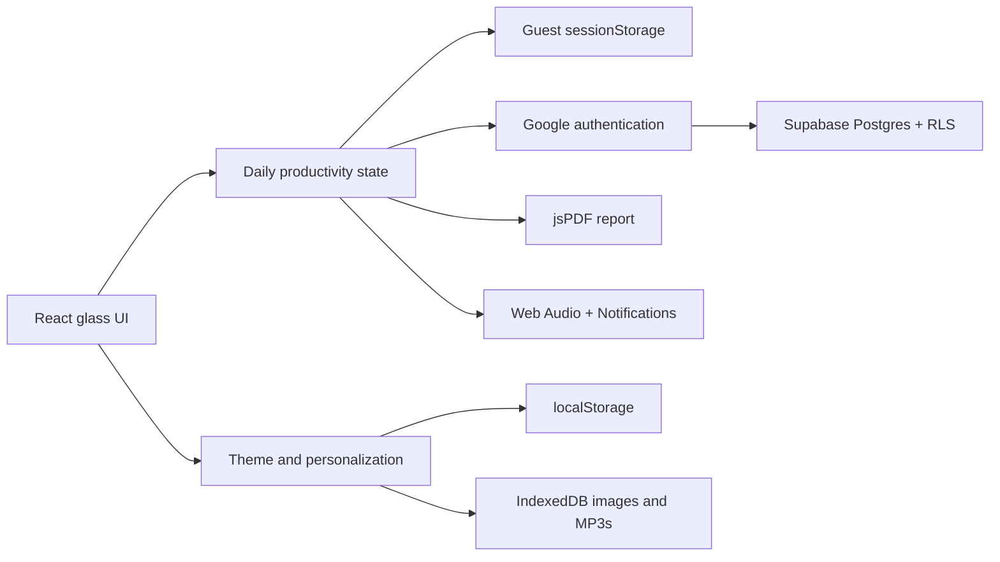
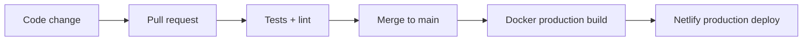

<div align="center">
  

  # Productivity Enforcer

  **A focused daily workspace for tasks, habits, Pomodoro sessions, accountability, and reflection.**

  [](https://react.dev/)
  [](https://vite.dev/)
  [](https://supabase.com/)
  [](https://www.netlify.com/)
  [](https://nodejs.org/)

  [Run locally](LOCAL_SETUP.md) · [Configure Google sign-in](GOOGLE_AUTH_SETUP.md) · [Deploy to Netlify](NETLIFY_DOCKER_GITHUB_ACTIONS.md)
</div>

---

## Overview

Productivity Enforcer combines the structure of a task manager with the rhythm of a Pomodoro timer and the visual calm of a customizable glass interface. It is designed around one day at a time: plan important work, maintain small daily habits, complete focused sessions, and export a record before the day resets.

The application works immediately as a private guest session. Google sign-in and Supabase can be configured when cross-device cloud persistence is wanted, but they are not required for local use.

## Highlights

| Area | What it provides |
| --- | --- |
| Macro planning | Create, complete, and remove the high-impact tasks for the current day. |
| Micro habits | Track, rename, add, and remove personalized daily habits. |
| Pomodoro focus | Configurable work/break durations, session counting, completion alarms, and break decisions. |
| Progress | Separate macro and micro progress rings provide an immediate view of the day. |
| Accountability | An hourly enforcer prompt asks for a written progress update and records the response. |
| Focus audio | Bundled focus tracks, custom MP3 uploads, track controls, and persistent volume. |
| Daily reporting | Generate a PDF containing tasks, habits, Pomodoro totals, and accountability logs. |
| Reminders | Receive an in-app 11:45 PM report reminder and an optional browser notification. |
| Personalization | Choose bundled or custom backgrounds and control glass-panel transparency. |
| Optional cloud sync | Sign in with Google to save today's productivity state in a protected Supabase row. |

## The glass UI

The interface is built as a small dynamic design system rather than a fixed theme:

- Glass surfaces use translucent backgrounds, blur, soft borders, and restrained shadows.
- A transparency control adjusts both panel opacity and backdrop blur in real time.
- The selected background is sampled in the browser to derive a matching accent color.
- Four backgrounds are bundled with the app, while custom images are stored locally in IndexedDB.
- Responsive rules preserve the workspace on desktop, tablet, and narrow browser layouts.

Theme preferences are browser-local by design. This keeps personal images and audio files on the user's device instead of uploading them to the cloud.

## How the application works



### Daily lifecycle

1. The app creates or restores the current local day's state.
2. Macro tasks, micro-habit checks, Pomodoro sessions, and enforcer logs update continuously.
3. Guest changes are saved to the current tab; signed-in changes are debounced and synchronized to Supabase.
4. At 11:45 PM, an open app offers a PDF report download.
5. At local midnight, daily activity resets while habit definitions and timer preferences are preserved where persistence is available.

## Persistence and privacy

| Data | Guest mode | Signed-in mode |
| --- | --- | --- |
| Today's tasks, checks, sessions, and logs | `sessionStorage`; survives refreshes in the same tab | Supabase; available across browsers and devices |
| Habit definitions and timer durations | Current guest tab | Supabase |
| Background choice and transparency | `localStorage` on this browser | `localStorage` on this browser |
| Custom background images | IndexedDB on this browser | IndexedDB on this browser |
| Custom focus music | IndexedDB on this browser | IndexedDB on this browser |
| Music volume | `localStorage` on this browser | `localStorage` on this browser |

Supabase Row Level Security ensures authenticated users can only read and write their own productivity row. Guest productivity data is removed when its browser tab is closed. Custom images and music never leave the browser through this application.

## Technology stack

### Application

| Tool | Role |
| --- | --- |
| React 19 | Component UI, state composition, and browser interactions |
| Vite 8 | Development server and optimized production builds |
| Modern CSS | Glass surfaces, responsive layout, animations, and dynamic theme variables |
| Supabase JS | Google OAuth session management and cloud data access |
| Supabase Postgres | Per-user productivity persistence |
| jsPDF | Client-side daily report generation |
| Web Audio API | Pomodoro and enforcer alarm synthesis |
| Notifications API | Optional end-of-day browser notifications |
| IndexedDB | Durable local storage for custom images and MP3 files |
| `localStorage` / `sessionStorage` | Theme preferences and guest session state |

### Engineering and delivery

| Tool | Role |
| --- | --- |
| Node.js 22 and npm | JavaScript runtime and reproducible dependency installation |
| Node test runner | Daily reset and data-normalization tests |
| Oxlint | Static analysis and code-quality checks |
| Docker | Reproducible multi-stage production builds |
| Nginx | Optional local container runtime with SPA routing |
| GitHub Actions | Test, lint, build, and deployment automation |
| Netlify | Static production hosting and SPA fallback routing |

## Repository structure

```text
Personal_Timer_Tracker/
|-- .github/workflows/netlify.yml       # CI/CD pipeline
|-- assets/                             # Shared desktop-era assets
|-- desktop/                            # Preserved Python desktop implementation
|-- supabase/schema.sql                 # Cloud table, grants, and RLS policies
|-- web/
|   |-- public/                         # Backgrounds, bundled audio, and icons
|   |-- src/
|   |   |-- components/                 # Dashboard and interactive UI
|   |   |-- context/                    # Authentication provider
|   |   |-- hooks/                      # Timer, theme, persistence, reminders
|   |   |-- lib/                        # Supabase client configuration
|   |   `-- utils/                      # Storage, audio, PDF, dates, tests
|   |-- Dockerfile                      # Build, export, and Nginx stages
|   |-- package.json                    # Web scripts and dependency manifest
|   `-- package-lock.json               # Reproducible npm dependency lock
|-- GOOGLE_AUTH_SETUP.md                # Optional OAuth and database guide
|-- LOCAL_SETUP.md                      # Complete local browser setup
|-- NETLIFY_DOCKER_GITHUB_ACTIONS.md    # Production deployment guide
|-- netlify.toml                        # Netlify build and SPA configuration
`-- README.md
```

## Quick start

The fastest guest-mode setup requires only Git and Node.js 22:

```bash
git clone https://github.com/Arnav131/Personal_Timer_Tracker.git
cd Personal_Timer_Tracker/web
npm ci
npm run dev
```

Open [http://localhost:5173](http://localhost:5173). Supabase credentials are optional; without them the app runs in guest mode and disables Google sign-in.

For environment setup, production previews, Docker instructions, browser personalization, and troubleshooting, see **[LOCAL_SETUP.md](LOCAL_SETUP.md)**.

## Available web commands

Run these commands from `web/`:

| Command | Purpose |
| --- | --- |
| `npm ci` | Install the exact dependency versions in `package-lock.json` |
| `npm run dev` | Start the Vite development server with hot reload |
| `npm test` | Run data lifecycle and normalization tests |
| `npm run lint` | Run Oxlint across the web workspace |
| `npm run build` | Create the optimized static site in `web/dist/` |
| `npm run preview` | Serve the production build locally for final verification |

## Optional cloud setup

Cloud sync requires a Supabase project, the included schema, and a Google OAuth client. The application only needs the browser-safe Supabase URL and publishable key:

```env
VITE_SUPABASE_URL=https://YOUR_PROJECT_REF.supabase.co
VITE_SUPABASE_PUBLISHABLE_KEY=sb_publishable_REPLACE_ME
```

Follow [GOOGLE_AUTH_SETUP.md](GOOGLE_AUTH_SETUP.md) for the complete database, OAuth, redirect URL, and verification procedure. Never expose a Supabase service-role key or a Google client secret in a Vite environment variable.

## Quality and deployment process

Pull requests run dependency installation, automated tests, and linting. A push to `main` repeats those checks, builds the static application inside Docker, and deploys the generated files to the production Netlify site.



The workflow uses concurrency cancellation so an outdated deployment cannot overtake a newer push. See [NETLIFY_DOCKER_GITHUB_ACTIONS.md](NETLIFY_DOCKER_GITHUB_ACTIONS.md) for first-time deployment and secret configuration.

## Contributing

Contributions and personal forks are welcome:

1. Fork the repository and create a focused feature branch.
2. Install dependencies with `npm ci` inside `web/`.
3. Make the change and verify it with `npm test`, `npm run lint`, and `npm run build`.
4. Open a pull request describing the behavior, motivation, and any visual changes.

Please keep credentials, generated builds, personal backgrounds, and local environment files out of commits.

## Additional documentation

- [Local browser setup and personalization](LOCAL_SETUP.md)
- [Google OAuth and Supabase setup](GOOGLE_AUTH_SETUP.md)
- [Docker, GitHub Actions, and Netlify deployment](NETLIFY_DOCKER_GITHUB_ACTIONS.md)
- [Supabase schema](supabase/schema.sql)
- [Software requirements specification](Productivity_Enforcer_SRS_v2.md)

## Legacy desktop application

`desktop/` preserves the original Python implementation built with CustomTkinter. It has its own dependency manifest at `desktop/requirements.txt`. The React web application is the actively deployed version, and its dependencies are managed exclusively through `web/package.json` and `web/package-lock.json`.
